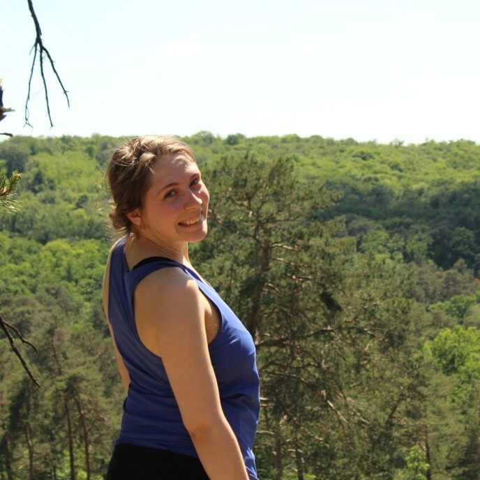
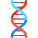

---
# Display name
title: 'A propos'
weight: 2

---

Je suis docteure en biologie computationnelle et biologie de synthèse. Je travaille actuellement sur l'évolution dirigée de *Bacillus subtilis*, une sympathique [bactérie à Gram-positif](https://fr.wikipedia.org/wiki/Gram_positif). Mon travail met l'accent sur la modélisation de l'évolution dirigée. Par conséquent, je partage mon temps entre la paillasse - le *wetlab* - et l'ordinateur - le *drylab*. 

Je m'intéresse aussi à la communication et au journalisme scientifique, et je suis toujours prête à vulgariser mon travail - mais pas que ! 

### Compétences

**Rédaction d'articles de vulgarisation scientifique**

**Création, animation et montage de podcasts scientifiques**

**Présentation du fonctionnement de la recherche et vulgarisation scientifique face public**

**Microbiologie, génétique et bioinformatique**

 Crédits pour les icônes utilisées : Flat Icons, Iconjam. 

