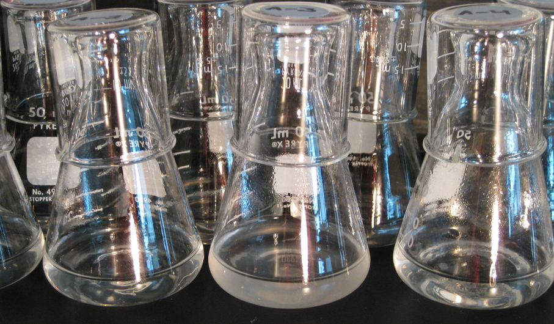

**C'est une belle histoire, que celle de cette expérience qui est en cours depuis plus de trente ans à l'Université du Michigan. A l'époque, personne ne pouvait deviner sa pérennité à venir, ni l'importance considérable qu'elle aurait sur le champ de la biologie de l'évolution. Essayons de résumer cette expérience - connue sous le petit nom de LTEE, pour Long Term Evolution Experiment - et son importance pour la communauté scientifique.**

La culture bactérienne est une technique simple mais primordiale en microbiologie : elle consiste à placer un microorganisme dans un milieu contenant des nutriments lui permettant de se reproduire. La croissance des bactéries durant la culture se divise en plusieurs phases : durant la phase de 'lag' ou phase d'adaptation, les bactéries s'adaptent au milieu, aux conditions de croissance : elles synthétisent alors les molécules nécessaires à leur reproduction. Puis elles entrent en phase exponentielle, la phase de croissance, pendant laquelle elles se divisent ; leur nombre double alors régulièrement. Lorsque les bactéries ont consommé la majorité des nutriments du milieu de culture, elles ne peuvent plus se reproduire : on dit alors que la culture est "à saturation".

En 1988, un jeune chercheur américain nommé Richard Lenski se lance dans une petite expérience : il met en place deux cultures d'*Escherichia coli*, une bactérie modèle -- c'est à dire bien connue des scientifiques -- et décide de maintenir cette expérience et de faire évoluer ces bactéries en laboratoire. Pour cela, il suffit de prélever le lendemain une partie de la culture liquide - qui contient alors peu de nutriments, mais de nombreuses bactéries - et de la placer dans du milieu de culture contenant des nutriments, pour que les bactéries puissent à nouveau se diviser. A chaque division, les bactéries peuvent acquérir des mutations ; placer une partie de la culture précédente dans un nouveau milieu permet donc aux bactéries de cumuler des mutations au fil de l'expérience.

## Le tube à essai : un outil simple mais pratique pour étudier l'évolution

Pourquoi vouloir reproduire l'évolution en laboratoire ? Dans la nature, les conditions d'évolution sont toujours changeantes : la température, l'humidité, les nutriments disponibles ou même la présence de prédateurs sont autant de facteurs qui vont influencer l'adaptation des organismes. Difficile alors de retracer le chemin évolutif emprunté par l'organisme. En laboratoire, les bactéries sont confortablement installées à une température contrôlée, leurs nutriments sont les mêmes chaque jour, et il est possible de les comparer d'une journée à l'autre, que ce soit sur le plan phénotypique -- leur apparence ou leur vitesse de croissance, par exemple -- ou génomique, le séquençage de leur ADN complet permettant de savoir quelles mutations sont apparues et sont restées dans chaque population. Plus de 30 ans après, l'expérience est toujours en cours, avec à ce jour 12 populations évoluant en parallèle, et comptabilisant chacune plus de 70,000 générations. De nombreux scientifiques ont d'ailleurs repris le flambeau du transfert quotidien des bactéries dans un nouveau milieu de culture. Richard Lenski estime que toutes les mutations qu'il est possible d'observer dans le génome de *E. coli* sont apparues au cours des trente ans de l'expérience, même si elles n'ont pas toutes été conservées. Les multiples mutations ont causé de nombreuses modifications des phénotypes dans ces populations : par exemple, dans toutes les populations, la taille des cellules a augmenté au fur et à mesure des générations, et les bactéries se sont reproduites de plus en plus vite -- on dit alors qu'elles gagnent en fitness. Elles ne cessent, d'ailleurs, de voir leur fitness s'améliorer, et leur évolution réserve en permanence des surprises à celles et ceux qui les étudient. Pour cette raison, aucune date de fin de l'expérience n'est prévue.

*Cet article a initialement été publié dans le numéro de Juin 2020 de Je Science donc j'écris, le journal de vulgarisation scientifique de l'association [Je Science donc je suis](https://twitter.com/JeScience). Vous pouvez retrouver ce numéro [ici](https://fr.calameo.com/read/00559114466161440c18c).*

N'hésitez pas à m'envoyer vos remarques et questions sur l'article !

### Sources

-   How a 30-Year Experiment Has Fundamentally Changed Our View of How Evolution Works. (2019). Discover Magazine. Consulté 11 juin 2020, à l'adresse <https://www.discovermagazine.com/planet-earth/how-a-30-year-experiment-has-fundamentally-changed-our-view-of-how>
-   Wiser, M. J., Ribeck, N., & Lenski, R. E. (2013). Long-Term Dynamics of Adaptation in Asexual Populations. Science, 342(6164), 1364‑1367. <https://doi.org/10.1126/science.1243357>

### Pour aller plus loin

-   [Le blog de Richard Lenski *himself*](https://telliamedrevisited.wordpress.com/) (en anglais)
-   [Les expériences scientifiques au long cours, dans l'émission *La Terre au Carré*](https://www.franceinter.fr/emissions/la-tete-au-carre/la-tete-au-carre-09-mai-2019)
:::
